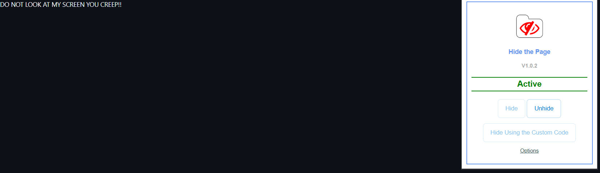

# Hide the Page

This browser extension hides your page if you don't want anyone to see it when they are around you.
You can use your own custom html code to show, instead of just a blank page.

## Why this extension?

- Only by one click.
- Open-Source.

## Chrome Extension

<https://chromewebstore.google.com/detail/hide-the-page/kfcknlmnhilpgggpjhbiffbhnagebhin>

## Screenshots

## Contributing

Pull requests are welcome. For major changes, please open an issue first to discuss what you would like to change.

## License

[MIT](https://choosealicense.com/licenses/mit/)
